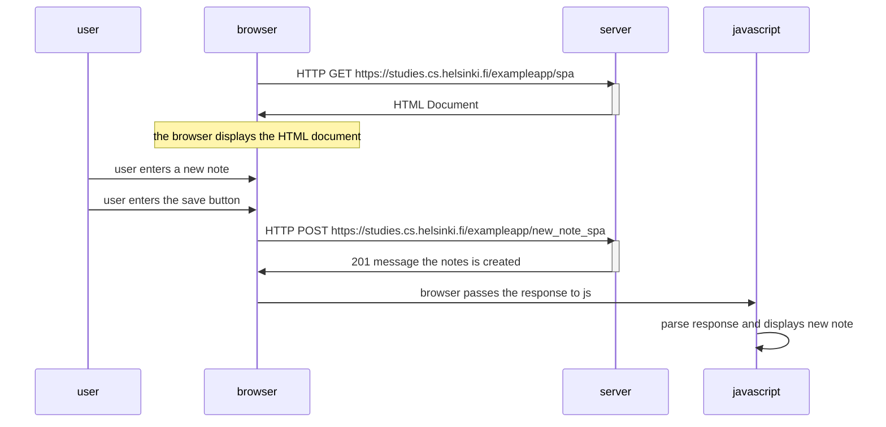

```mermaid
sequenceDiagram
    participant user
    participant browser
    participant server
    participant javascript

    browser ->> server: HTTP GET https://studies.cs.helsinki.fi/exampleapp/spa
    activate server
    server ->> browser: HTML Document
    deactivate server

    note over browser: the browser displays the HTML document

    user ->> browser: user enters a new note
    user ->> browser: user enters the save button
    
    browser ->> server: HTTP POST https://studies.cs.helsinki.fi/exampleapp/new_note_spa
    activate server
    server ->> browser: 201 message the notes is created
    deactivate server

    browser ->> javascript: browser passes the response to js
    javascript ->> javascript: parse response and displays new note

```