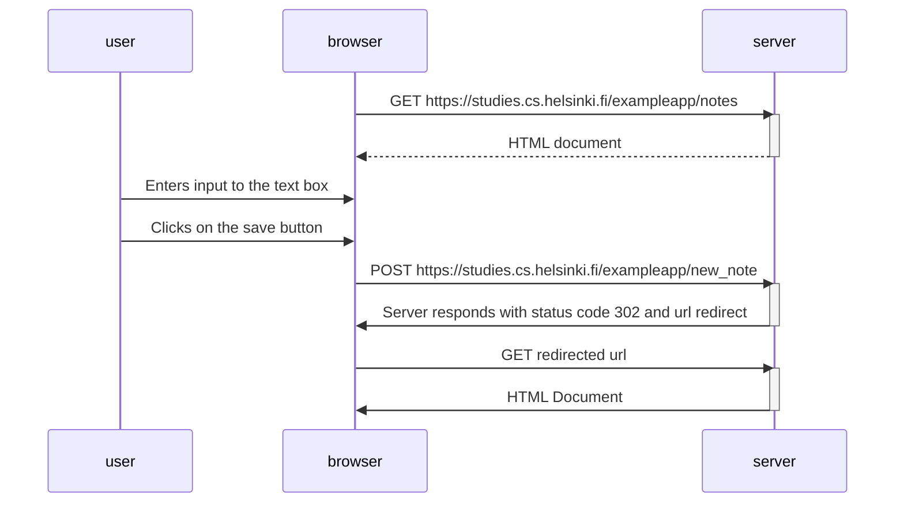

```mermaid
sequenceDiagram
    participant user
    participant browser
    participant server

    browser->>server: GET https://studies.cs.helsinki.fi/exampleapp/notes
    activate server
    server-->>browser: HTML document
    deactivate server

    user->>browser: Enters input to the text box
    user->>browser: Clicks on the save button

    browser->>server: POST https://studies.cs.helsinki.fi/exampleapp/new_note
    activate server
    server->>browser: Server responds with status code 302 and url redirect
    deactivate server

    browser->>server: GET redirected url
    activate server
    server->>browser: HTML Document
    deactivate server


```
