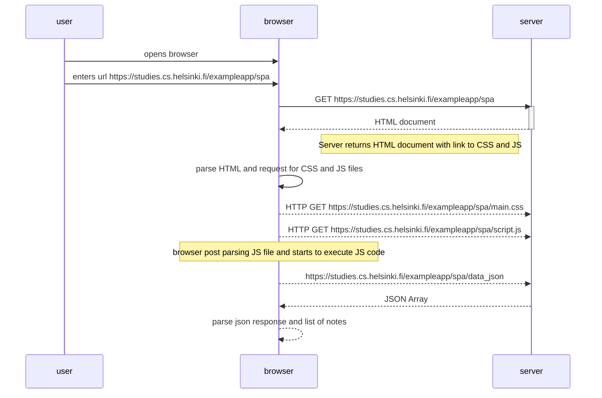

```mermaid
sequenceDiagram
    participant user
    participant browser
    participant server

    user->>browser: opens browser
    user->>browser: enters url https://studies.cs.helsinki.fi/exampleapp/spa

    browser->>server: GET https://studies.cs.helsinki.fi/exampleapp/spa
    activate server
    server-->>browser: HTML document
    deactivate server
    Note left of server: Server returns HTML document with link to CSS and JS

    browser ->> browser: parse HTML and request for CSS and JS files

    browser -->> server: HTTP GET https://studies.cs.helsinki.fi/exampleapp/spa/main.css
    browser -->> server: HTTP GET https://studies.cs.helsinki.fi/exampleapp/spa/script.js

    Note over browser: browser post parsing JS file and starts to execute JS code

    browser -->> server: https://studies.cs.helsinki.fi/exampleapp/spa/data_json
    server -->> browser: JSON Array

    browser -->> browser: parse json response and list of notes

```